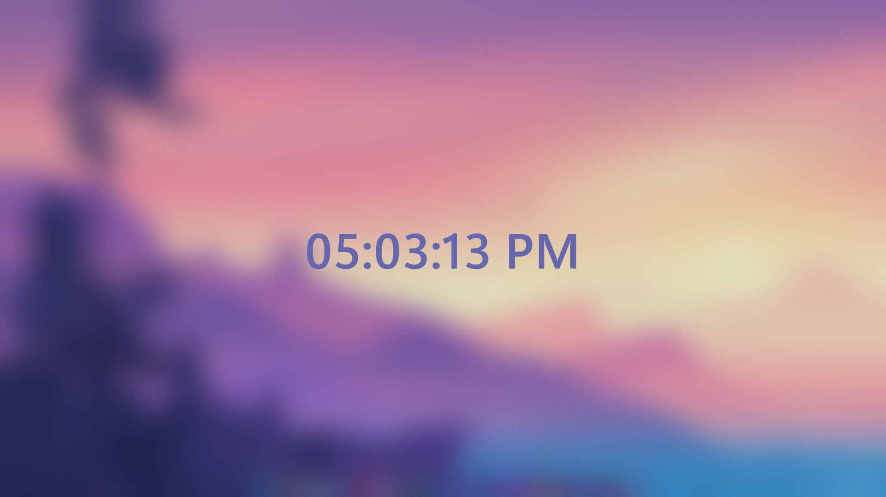

# Minimal-Clock
 a VERY minmal astethic clock made in cython

- To run the program, you need to have python installed on your computer. You can download it from [here](https://www.python.org/downloads/).

## Images



## How Run the program on Windows
### NOTE: YOU HAVE TO KEEP THE MAIN FOLDERS NAME AS "Minimal-Clock" OR THE PROGRAM WILL NOT RUN
Simply run the run-py.bat or run-py3.bat file, all the dependencies will be installed automatically.

## How to run on linux and mac
For most people this should be enough,
```cmd
python3 .\app.py
```
if that does not work then do,
```cmd
python .\app.py
```

## What does this program do?
- This program shows the time or whatever you want to show in a very minimalistic way.
- It is made in python and cython.
- It is very easy to use and modify.
- It is very easy to add new features.

### Features
- The program uses less than 1% of the CPU.
- The program uses less than 40Mb of the RAM.
- The program will never show on top of other windows it will always be behind them.
- The program can show the time in 12 hour or 24 hour format.
- The program can show the date.
- The program can automatically update it-self if I add new features. (You can change this in the config file)
- You can change the text color.
- You can change the font.
- You can change the font size.
- You can change the text.

## Configuring the program
- There is a config file that you can use to change the settings of the program.
- The config file is already created for you, with the default settings.
- the editing format is included in the config file.

## Dependencies
- python 3.6 or higher
- cython
- ctypes
- time
- os
- sys
- time
- PySide2

## How to install dependencies
- python 3.6 or higher
  - This should be installed by default on most computers
- The rest of the dependencies are automatically installed when you run the program if you dont have them installed. Most of them are installed by default on most computers.
